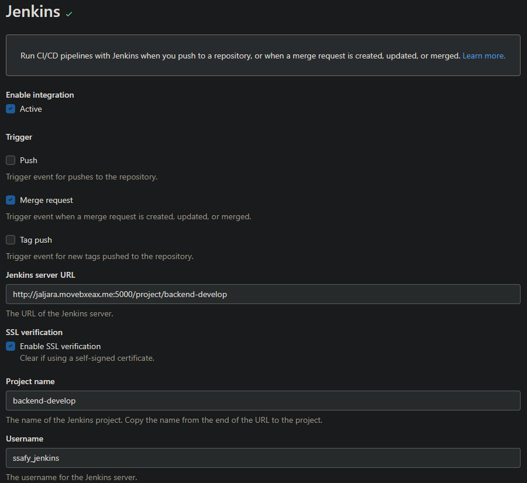
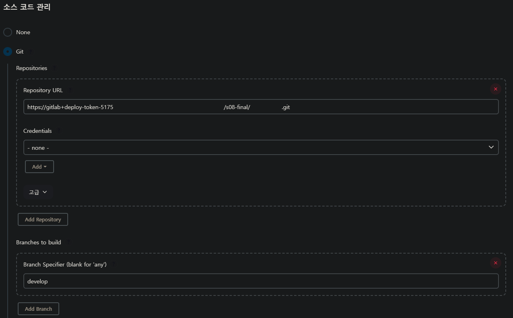
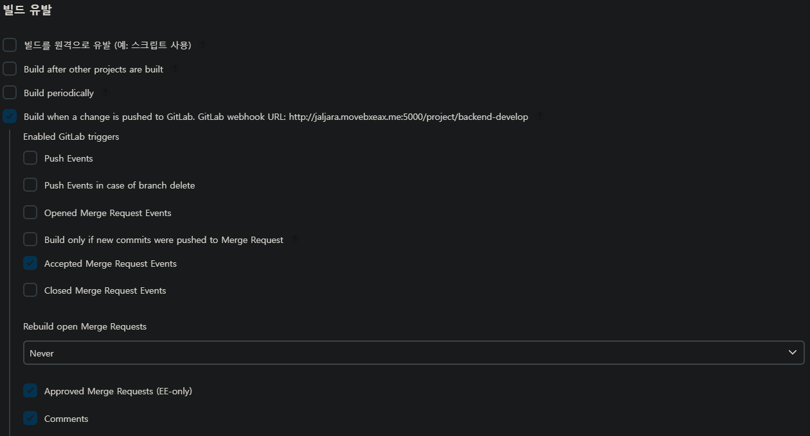
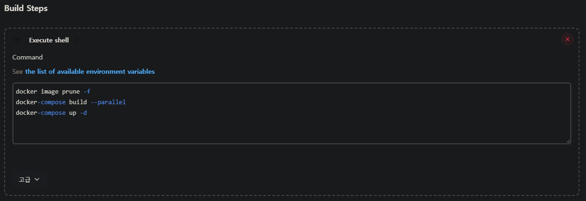
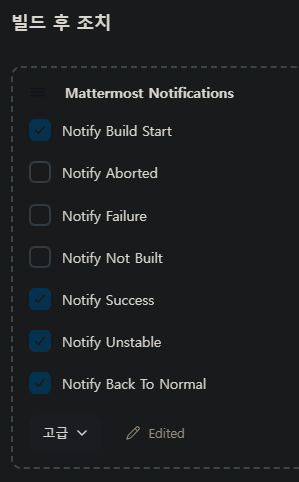
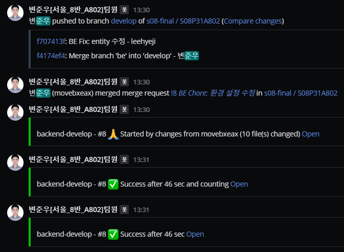

# Jenkins 설치

```bash
curl -fsSL https://pkg.jenkins.io/debian-stable/jenkins.io-2023.key | sudo tee \
  /usr/share/keyrings/jenkins-keyring.asc > /dev/null

echo deb [signed-by=/usr/share/keyrings/jenkins-keyring.asc] \
  https://pkg.jenkins.io/debian-stable binary/ | sudo tee \
  /etc/apt/sources.list.d/jenkins.list > /dev/null

sudo apt-get upgrade

sudo apt-get update

sudo apt-get install jenkins
```

# Docker 설치

```bash
# 설치 준비
sudo apt-get update
sudo apt-get install \
    ca-certificates \
    curl \
    gnupg

sudo install -m 0755 -d /etc/apt/keyrings
curl -fsSL https://download.docker.com/linux/ubuntu/gpg | sudo gpg --dearmor -o /etc/apt/keyrings/docker.gpg
sudo chmod a+r /etc/apt/keyrings/docker.gpg

echo \
  "deb [arch="$(dpkg --print-architecture)" signed-by=/etc/apt/keyrings/docker.gpg] https://download.docker.com/linux/ubuntu \
  "$(. /etc/os-release && echo "$VERSION_CODENAME")" stable" | \
  sudo tee /etc/apt/sources.list.d/docker.list > /dev/null

# 설치
sudo apt-get update

sudo apt-get install docker-ce docker-ce-cli containerd.io docker-buildx-plugin docker-compose-plugin

# 사용자 그룹 설정
sudo groupadd docker
sudo usermod -aG docker $USER

# jenkins 계정에 대해 sudo 없이 docker 명령 사용 가능하도록 설정
sudo usermod -aG docker jenkin
```

# Jenkins-Gitlab 연동 설정

## Gitlab 설정

Settings→Integrations→Jenkins 하위에 아래와 같이 설정합니다.



## Jenkins 설정

각 작업에 대해 아래와 같이 소스코드 관리 설정합니다.



이후 MR이 승인된 경우 자동 빌드하도록 아래와 같이 설정합니다.



빌드 스크립트는 아래와 같이 설정합니다.

(Blue-Green 형태의 무중단 배포는 아직 적용되지 않음)



```bash
docker image prune -f
docker-compose build --parallel
docker-compose up -d
```

빌드 결과를 지정된 MM 채널에 노티합니다.




# Envoy, SSL 설정

## Envoy 설정

Envoy 설정값은 envoy.yaml 파일에 정의되어 있습니다.

```yaml
admin:
  address:
    socket_address: { address: 0.0.0.0, port_value: 9901 }

static_resources:
  listeners:
    - name: listener_0
      address:
        socket_address: { address: 0.0.0.0, port_value: 443 }
      filter_chains:
        - filters:
            - name: envoy.filters.network.http_connection_manager
              typed_config:
                "@type": type.googleapis.com/envoy.extensions.filters.network.http_connection_manager.v3.HttpConnectionManager
                stat_prefix: ingress_http
                upgrade_configs:
                  - upgrade_type: websocket
                codec_type: AUTO
                route_config:
                  name: local_route
                  virtual_hosts:
                    - name: local_service
                      domains: ["jaljara.movebxeax.me"]
                      routes:
                        - match: { prefix: "/api" }
                          route: { cluster: jaljara_backend }
                        - match: { prefix: "/privacy" }
                          route: { cluster: jaljara_backend }
                http_filters:
                  - name: envoy.filters.http.router
                    typed_config:
                      "@type": type.googleapis.com/envoy.extensions.filters.http.router.v3.Router
          transport_socket:
            name: envoy.transport_sockets.tls
            typed_config:
              "@type": type.googleapis.com/envoy.extensions.transport_sockets.tls.v3.DownstreamTlsContext
              common_tls_context:
                tls_certificates:
                  - certificate_chain:
                      filename: /etc/letsencrypt/live/jaljara.movebxeax.me/fullchain.pem
                    private_key:
                      filename: /etc/letsencrypt/live/jaljara.movebxeax.me/privkey.pem
                validation_context:
                  trusted_ca:
                    filename: /etc/ssl/certs/ca-certificates.crt
                alpn_protocols: ["h2,http/1.1"]

    - name: listener_1
      address:
        socket_address: { address: 0.0.0.0, port_value: 80 }
      filter_chains:
        - filters:
            - name: envoy.filters.network.http_connection_manager
              typed_config:
                "@type": type.googleapis.com/envoy.extensions.filters.network.http_connection_manager.v3.HttpConnectionManager
                stat_prefix: ingress_http
                codec_type: AUTO
                route_config:
                  name: local_route
                  virtual_hosts:
                    - name: local_service
                      domains: ["jaljara.movebxeax.me"]
                      routes:
                        - match: { prefix: "/api" }
                          redirect: { https_redirect: true }
                        - match: { prefix: "/privacy" }
                          redirect: { https_redirect: true }
                http_filters:
                  - name: envoy.filters.http.router
                    typed_config:
                      "@type": type.googleapis.com/envoy.extensions.filters.http.router.v3.Router

  clusters:
    - name: jaljara_backend
      connect_timeout: 0.25s
      type: LOGICAL_DNS
      lb_policy: ROUND_ROBIN
      load_assignment:
        cluster_name: backend
        endpoints:
          - lb_endpoints:
              - endpoint:
                  address:
                    socket_address:
                      address: jaljara.movebxeax.me
                      port_value: 8080
      transport_socket:
        name: envoy.transport_sockets.tls
        typed_config:
          "@type": type.googleapis.com/envoy.extensions.transport_sockets.tls.v3.UpstreamTlsContext
          common_tls_context:
            tls_certificates:
              - certificate_chain:
                  filename: /etc/letsencrypt/live/jaljara.movebxeax.me/fullchain.pem
                private_key:
                  filename: /etc/letsencrypt/live/jaljara.movebxeax.me/privkey.pem
            validation_context:
              trusted_ca:
                filename: /etc/ssl/certs/ca-certificates.crt
            alpn_protocols: ["h2,http/1.1"]
```

## SSL 설정

ssl의 경우 별도의 인증서를 필요로 합니다. 이 프로젝트에서는 letsencrypt의 인증서를 사용했으며, 별도의 인증서가 있는 경우 해당 과정을 생략해도 됩니다.

```bash
sudo snap install core; sudo snap refresh core
sudo snap install --classic certbot
sudo certbot certonly --standalone

# 해당 파일이 저장되는 경로는 도메인 기준
# /etc/letsencrypt/live/{domain}/fullchain.pem
# /etc/letsencrypt/live/{domain}/privkey.pem
```

## Envoy 연동

해당 파일을 docker에서 접근할 수 있게 volume으로 연결하면 됩니다.

```bash
envoy:
    image: envoyproxy/envoy-dev
    ports:
      - "80:80"
      - "443:443"
    environment:
      ENVOY_UID: 0
    volumes:
      - ./envoy.yaml:/etc/envoy/envoy.yaml
      - /etc/letsencrypt/live/jaljara.movebxeax.me/privkey.pem:/etc/letsencrypt/live/jaljara.movebxeax.me/privkey.pem
      - /etc/letsencrypt/live/jaljara.movebxeax.me/fullchain.pem:/etc/letsencrypt/live/jaljara.movebxeax.me/fullchain.pem
```
